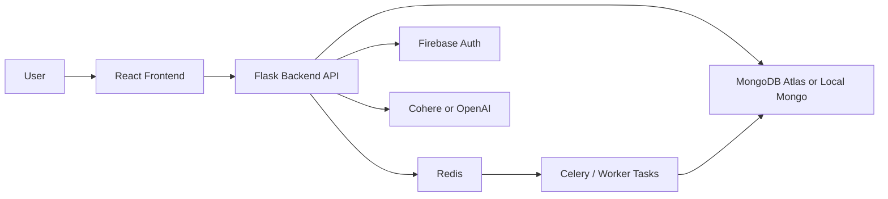

# Program Flow and Setup

This file explains how the codebase runs end to end, which environment variables it needs, where to place MongoDB and API keys, and how to start the app from the terminal or with Docker.

## High-Level Flow



## What Happens When The App Runs

1. The user opens the React app in the browser.
2. The frontend reads `VITE_API_BASE_URL` and sends requests to the backend.
3. The backend validates Firebase login tokens for protected routes.
4. Resume analysis, coaching, recruiter tools, and interview flows call the backend API.
5. If async mode is enabled, the backend sends work to Redis and the worker processes it.
6. MongoDB stores history, user records, and saved analysis data.
7. The backend calls the LLM provider for AI responses when a feature needs generation or analysis.

## Which Keys And Links Are Used

### API keys and auth values

- `COHERE_API_KEY` is the default AI key used by the backend because the default model points to Cohere.
- The model string documented for the stable setup is `LLM_MODEL=cohere:command-r7b-12-2024`.
- `OPENAI_API_KEY` is optional and only used if `LLM_MODEL` is switched to an OpenAI provider string.
- `VITE_FIREBASE_API_KEY`, `VITE_FIREBASE_AUTH_DOMAIN`, `VITE_FIREBASE_PROJECT_ID`, and `VITE_FIREBASE_APP_ID` are the frontend Firebase web settings.
- `FIREBASE_CREDENTIAL_PATH` points to the Firebase service account JSON used by the backend.
- To get that JSON file, open Firebase Console, go to Project Settings, choose Service Accounts, then click Generate new private key.

### MongoDB link

- If you are using MongoDB Atlas, copy the connection string from Atlas by opening your cluster, selecting Connect, then Drivers, and copying the `mongodb+srv://...` URI.
- Put that URI in `MONGO_URI` inside your local `.env` file.
- Example:

```bash
MONGO_URI=mongodb+srv://<username>:<password>@<cluster-host>/<database>?retryWrites=true&w=majority
```

- If you are using the local Docker Mongo container, the URI is usually:

```bash
MONGO_URI=mongodb://mongo:27017/resumeAnalyzer
```

## Where To Put The Environment Variables

This project keeps example files in Git, but real `.env` files and Firebase JSON credentials are ignored by GitHub through `.gitignore`. That means environment variables must be handled differently depending on where the code runs.

### 1. Local Development

- Root `.env` for Docker: run `cp .env.example .env` and fill in your keys.
- Backend `.env` for terminal runs: run `cp backend/.env.example backend/.env`.
- Never commit the real `.env` files or the Firebase JSON file.

### 2. Cloud Deployment: Vercel and Render

GitHub will not store your secrets for deployment, so Vercel and Render need them added manually in their dashboards.

- Frontend on Vercel: open Settings, then Environment Variables, and add every frontend value that starts with `VITE_`.
- Vite strictly requires the `VITE_` prefix. If the prefix is missing, the value will not be exposed during the build step and Firebase login can fail.
- Backend on Render: open Environment and add the backend keys such as `MONGO_URI` and `COHERE_API_KEY`.
- For the Firebase Admin JSON on Render, use Secret Files to upload the JSON contents and point `FIREBASE_CREDENTIAL_PATH` to that secure file.

### Root `.env`

Use the root `.env` for Docker Compose and general runtime values like MongoDB, Redis, Firebase web keys, and AI keys.

For frontend variables, remember that Vite and Vercel only expose build-time variables that start with `VITE_`, so anything without that prefix will not reach the browser bundle.

Start from the example file:

```bash
cp .env.example .env
```

### Backend `.env`

The backend can also read `backend/.env` directly.

Start from the backend example file:

```bash
cp backend/.env.example backend/.env
```

### Important rule

- Commit `.env.example` files only.
- Do not commit the real `.env` files.
- Do not commit real Firebase service account JSON files or API secrets.

## What To Fill In

At minimum, set these values in your local `.env` files:

- `MONGO_URI`
- `REDIS_URL`
- `COHERE_API_KEY` or `OPENAI_API_KEY`
- `FIREBASE_CREDENTIAL_PATH`
- `VITE_FIREBASE_API_KEY`
- `VITE_FIREBASE_AUTH_DOMAIN`
- `VITE_FIREBASE_PROJECT_ID`
- `VITE_FIREBASE_APP_ID`
- `VITE_API_BASE_URL` if the frontend should point somewhere other than the default backend URL

## How To Run From The Terminal

### Option 1: Run locally without Docker

Open one terminal for the backend:

```bash
python -m venv .venv
source .venv/bin/activate
pip install -r backend/requirements.txt
cp backend/.env.example backend/.env
python run.py
```

Open a second terminal for the frontend:

```bash
cd frontend
npm install
npm run dev
```

Open a third terminal if you want the worker:

```bash
source .venv/bin/activate
python run_worker.py
```

### Option 2: Run everything with Docker

From the project root:

```bash
docker compose up -d --build
```

Useful follow-up commands:

```bash
docker compose logs -f backend
docker compose logs -f frontend
docker compose logs -f worker
docker compose down
```

## Ports You Will See

- Backend local run: `http://localhost:5000`
- Frontend local dev server: `http://localhost:5173`
- Docker frontend: `http://localhost:8080`
- Docker backend: `http://localhost:5000`

## Current Code Paths Worth Knowing

- `run.py` starts the Flask app.
- `run_worker.py` starts the task worker.
- `backend/config.py` loads environment variables and sets defaults.
- `backend/app.py` wires Flask, Firebase, Redis, MongoDB, and the LLM provider.
- `frontend/src/api/client.ts` defines the frontend API base URL.
- `docker-compose.yml` starts backend, frontend, Redis, worker, and MongoDB.

## One-Sentence Summary

The frontend sends requests to the backend, the backend authenticates users and calls AI/database services, Redis and the worker handle async jobs, and MongoDB stores analysis history and user data.